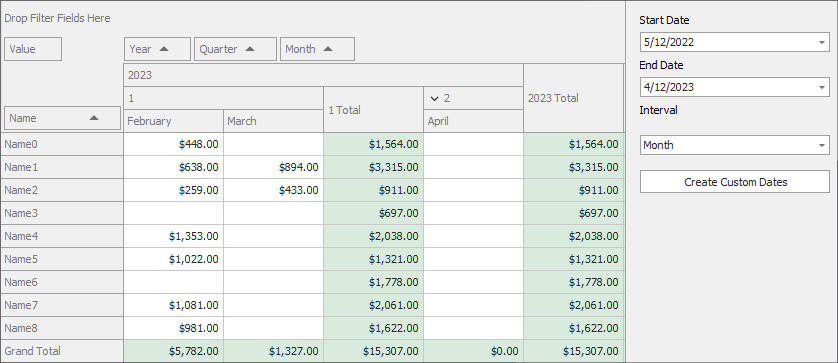

<!-- default badges list -->

<!-- default badges end -->

# Pivot Grid for WinForms - How to Add Custom Field Values (Rows/Columns) that are not Present in a Data Source

Pivot Grid does not display field values in row and column areas if these values are not represented in the underlying data source. This example demonstrates how to create a data source wrapper that contains merged values ​​from a data source and a custom collection. In the example, the `CustomDates` collection is filled with DateTime values based on the actual Start/End DateTime range and the specified interval (for example, `Month`). This collection is passed to the `DateDataSourceWrapper` class instance along with the original data source collection (`Table.DefaultView`). The `CustomDates` collection is merged with the original data table and you do not need to modify the data source. When Pivot Grid requests data with the common [IList](https://msdn.microsoft.com/en-us/library/system.collections.ilist(v=vs.110).aspx) and [ITypedList](https://msdn.microsoft.com/en-us/library/system.componentmodel.itypedlist(v=vs.110).aspx) interface methods, the `DateDataSourceWrapper` object returns data from the original collection or generates `EmptyObjectPropertyDescriptor` objects to return rows with null "Date" field values.

The following image illustrates a Pivot Grid that displays the custom `March` field value from the `CustomDates` collection along with field values from the data source:

## Files to Review

* [DateDataSourceWrapper.cs](./CS/CustomDatesPivot/DateDataSourceWrapper.cs) (VB: [DateDataSourceWrapper.vb](./VB/CustomDatesPivot/DateDataSourceWrapper.vb))
* [Form1.cs](./CS/CustomDatesPivot/Form1.cs) (VB: [Form1.vb](./VB/CustomDatesPivot/Form1.vb))
* [Program.cs](./CS/CustomDatesPivot/Program.cs) (VB: [Program.vb](./VB/CustomDatesPivot/Program.vb))

## Documentation

* [Fields](https://docs.devexpress.com/WindowsForms/1918/controls-and-libraries/pivot-grid/fundamentals/pivot-grid-fields)
## More Examples 

- [Pivot Grid for WPF - How to Add Custom Field Values (Rows/Columns) that Are Not Present in a Data Source](https://github.com/DevExpress-Examples/how-to-add-custom-field-values-rows-columns-that-are-not-present-in-a-datasource-t615806)

- [How to create a data source wrapper that adds an empty item to the lookup list](https://github.com/DevExpress-Examples/how-to-create-a-data-source-wrapper-that-adds-an-empty-item-to-the-lookup-list-e1180)
<!-- feedback -->
## Does this example address your development requirements/objectives?

 

(you will be redirected to DevExpress.com to submit your response)
<!-- feedback end -->
